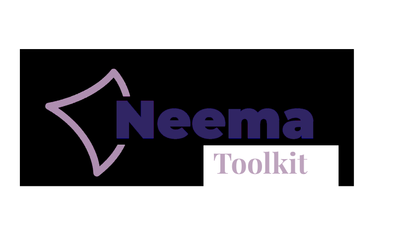

# Guía de Instalación — NEEMA Toolkit
# 
**Autor:** David Valencia Toscano

Esta guía le ayudará a instalar y poner en marcha el proyecto **NEEMA Toolkit** en su entorno local utilizando LocalWP.

## Requisitos Previos

- **LocalWP** instalado ([Descargar LocalWP](https://localwp.com/))
- Archivo **.zip** del proyecto "NEEMA-Toolkit-TFG" (incluido en esta carpeta)

El Toolkit está preparado para las siguientes versiones:
- **PHP:** 8.2.27
- **Web Server:** nginx 1.26.1
- **Database:** MySQL 8.0.25

## Pasos de Instalación

1. **Instala LocalWP**
	- Descargue e instale LocalWP desde [aquí](https://localwp.com/).

2. **Importa el proyecto en LocalWP**
	- Siga la guía oficial: [Cómo importar un sitio WordPress en LocalWP](https://localwp.com/help-docs/getting-started/how-to-import-a-wordpress-site-into-local/#import-a-site)
	- Seleccione el archivo **.zip** del proyecto "NEEMA-Toolkit-TFG.zip" cuando se le solicite.
	- Durante la importación, asegúrese de seleccionar las versiones:
	  - **PHP:** 8.2.27
	  - **Web Server:** nginx 1.26.1
	  - **Database:** MySQL 8.0.25

3. **Acceda al sitio WordPress importado**
	- Una vez finalizada la importación, inicie el sitio desde LocalWP.
	- Acceda al panel de administración o al frontend usando los usuarios de prueba.

## Usuarios de Prueba

> **Nota importante:**
>
> La Toolkit se entrega limpia, es decir, sin recursos ni organismos cargados. Sin embargo, mantiene datos de prueba como módulos, temáticas, miembros, etc., necesarios para su correcto funcionamiento. Considere que estos datos de prueba pueden no coincidir con el estado actual de la versión desplegada en producción.


Puede acceder con los siguientes usuarios preconfigurados:

| Nombre de Usuario   | Correo                      | Contraseña           |
|--------------------|-----------------------------|----------------------|
| visitante          | visitante@neema.com         | NeemaToolkit2026     |
| gestorcontenidos   | gestorcontenidos@neema.com  | NeemaToolkit2026     |
| adminfuncional     | adminfuncional@neema.com    | NeemaToolkit2026     |
| admin              | admin@neema.com             | NeemaToolkit2026     |

---

## Configuración de envío de correos electrónicos

Para que el sitio pueda enviar correos electrónicos, es necesario configurar un servidor de correo propio utilizando el plugin **FluentSMTP** ya instalado.Acceda al panel de configuración y añada los datos de su propio servidor SMTP.

## Configuración de Google reCAPTCHA

Para proteger el formulario de registro del sitio se utiliza Google reCAPTCHA v3, debe obtener las claves de su propio reCAPTCHA en [Google reCAPTCHA](https://www.google.com/recaptcha/admin/create) y añadirlas al archivo `wp-config.php` de la siguiente forma:

```php
define('RECAPTCHA_SITE_KEY', '');
define('RECAPTCHA_SECRET_KEY', '');
```

Reemplace los valores entre comillas por las claves proporcionadas por Google para su dominio. Estas constantes son necesarias para que la integración funcione correctamente.

---

## Ejecución de Tests

El proyecto incluye una suite de tests automatizados para validar la funcionalidad del tema NEEMA. A continuación se detalla cómo ejecutarlos.

### Requisitos Previos para Tests

Para ejecutar los tests, necesita tener instalado:

- **PHP 8.2.27** (incluido en LocalWP)
- **Composer** - Gestor de dependencias de PHP (incluido en LocalWP)

### Instalación de Dependencias de Desarrollo
Para ejecutar la suite de test, se recomienda acceder a través de LocalWP a la **Site Shell**, desde donde se pueden ejecutar el resto de comandos a continuación:

Los tests requieren dependencias especiales que se instalan solo en modo desarrollo. Para instalarlas, ejecute:

```bash
cd wp-content/themes/neema-theme
composer install
```

Esto instalará las siguientes herramientas:

- **PHPUnit 9.6** - Framework de testing unitario
- **Brain Monkey 2.6** - Herramienta para mockear funciones de WordPress
- **Mockery 1.6** - Librería para crear mocks de objetos

### Ejecutar los Tests

```bash
cd wp-content/themes/neema-theme

# Ejecutar todos los tests
composer test

```


